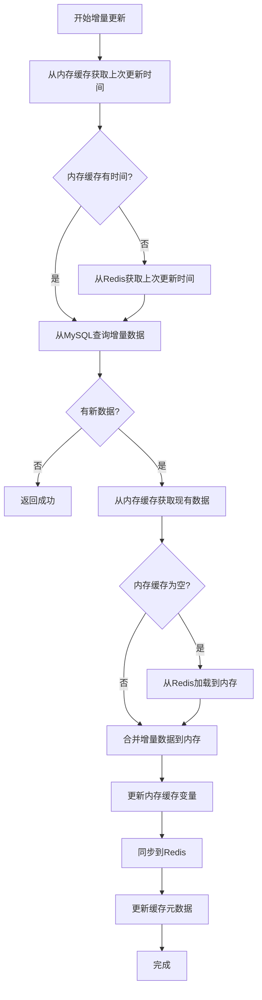

# 装备缓存内存增量更新指南

装备缓存增量更新功能现在支持内存缓存优先的操作模式，提供更高效的数据更新体验。

## 功能特性

### 1. 内存缓存优先策略
- **优先使用内存缓存**: 增量更新时优先从内存缓存获取现有数据
- **自动加载机制**: 如果内存缓存为空，自动从Redis加载到内存
- **双重保障**: 内存缓存 + Redis缓存的双重数据保障

### 2. 高效更新流程
- **内存操作**: 增量数据直接合并到内存缓存变量
- **异步同步**: 内存缓存更新后异步同步到Redis
- **容错处理**: Redis同步失败时内存缓存仍然有效

### 3. 多种更新方式
- **基于时间戳更新**: 根据上次更新时间获取新数据
- **自动检测更新**: 自动检测是否有新数据并执行更新
- **强制更新**: 忽略状态检查直接执行更新

## 技术架构

### 内存缓存结构
```python
class EquipMarketDataCollector:
    def __init__(self):
        # 内存缓存变量
        self._full_data_cache = None  # pandas.DataFrame
        
        # Redis缓存配置
        self._full_cache_key = "equipment_market_data_full"
        self.redis_cache = get_redis_cache()
```

### 增量更新流程


## API接口

### 1. 增量更新缓存
```http
POST /api/v1/equipment/cache/incremental-update
Content-Type: application/json

{
    "type": "auto",  // 更新类型: auto, time
    "last_update_time": "2024-01-01T00:00:00"  // 可选，基于时间更新时使用
}
```

### 2. 获取增量更新状态
```http
GET /api/v1/equipment/cache/incremental-status
```

### 3. 自动检测更新
```http
POST /api/v1/equipment/cache/auto-update
```

### 4. 强制增量更新
```http
POST /api/v1/equipment/cache/force-update
```

## 使用示例

### Python代码示例

#### 1. 基本增量更新
```python
from src.evaluator.market_anchor.equip.equip_market_data_collector import EquipMarketDataCollector

# 创建采集器实例
collector = EquipMarketDataCollector()

# 执行增量更新
success = collector.incremental_update()
if success:
    print("增量更新成功")
else:
    print("增量更新失败")
```

#### 2. 基于时间戳的增量更新
```python
from datetime import datetime, timedelta

# 指定更新时间
last_update_time = datetime.now() - timedelta(hours=1)

# 执行增量更新
success = collector.incremental_update(last_update_time)
```

#### 3. 自动检测更新
```python
# 自动检测并更新
success = collector.auto_incremental_update()
```

#### 4. 获取更新状态
```python
# 获取增量更新状态
status = collector.get_incremental_update_status()
print(f"是否有新数据: {status['has_new_data']}")
print(f"新数据数量: {status['new_data_count']}")
```

### 前端JavaScript示例

#### 1. 增量更新
```javascript
// 执行增量更新
const response = await this.$api.equipment.incrementalUpdateEquipment({
    type: 'auto'
})

if (response.code === 200) {
    console.log('增量更新成功', response.data)
} else {
    this.$notify.error({
        title: '错误',
        message: response.message || '增量更新失败'
    })
}
```

#### 2. 自动检测更新
```javascript
// 自动检测更新
const response = await this.$api.equipment.autoIncrementalUpdateEquipment()
if (response.code === 200) {
    console.log('自动检测更新成功', response.data)
}
```

#### 3. 获取更新状态
```javascript
// 获取增量更新状态
const response = await this.$api.equipment.getIncrementalUpdateStatus()
if (response.code === 200) {
    const status = response.data
    console.log('是否有新数据:', status.has_new_data)
    console.log('新数据数量:', status.new_data_count)
}
```

## 内存缓存管理

### 1. 检查内存缓存状态
```python
# 获取内存缓存数据
memory_data = collector._get_existing_data_from_memory()
if memory_data is not None:
    print(f"内存缓存数据量: {len(memory_data)} 条")
else:
    print("内存缓存为空")
```

### 2. 手动同步到Redis
```python
# 同步内存缓存到Redis
success = collector._sync_memory_cache_to_redis(data)
if success:
    print("同步成功")
else:
    print("同步失败")
```

### 3. 清空内存缓存
```python
# 清空内存缓存
collector._full_data_cache = None
```

## 性能优势

### 1. 内存操作优势
- **速度更快**: 内存操作比Redis操作快10-100倍
- **减少网络开销**: 避免频繁的Redis网络请求
- **批量处理**: 支持批量数据合并操作
- **优先策略**: 所有操作都优先使用内存缓存

### 2. 容错机制
- **Redis故障容错**: Redis不可用时内存缓存仍然有效
- **数据一致性**: 内存缓存作为主要数据源，Redis作为持久化存储
- **自动恢复**: Redis恢复后自动同步内存缓存
- **降级策略**: 内存缓存为空时自动从Redis加载

### 3. 资源优化
- **内存复用**: 避免重复加载相同数据
- **按需加载**: 只在需要时从Redis加载数据
- **智能缓存**: 自动管理内存缓存生命周期
- **状态优先**: 状态检查优先从内存缓存获取信息

### 4. 操作流程优化
- **时间获取**: 优先从内存缓存获取最后更新时间
- **状态检查**: 优先从内存缓存获取状态信息
- **数据合并**: 直接在内存中进行数据合并操作
- **异步同步**: 内存更新后异步同步到Redis

## 最佳实践

### 1. 定期增量更新
```python
import schedule
import time

def scheduled_incremental_update():
    """定时增量更新"""
    collector = EquipMarketDataCollector()
    success = collector.auto_incremental_update()
    if success:
        print("定时增量更新成功")
    else:
        print("定时增量更新失败")

# 每小时执行一次增量更新
schedule.every().hour.do(scheduled_incremental_update)

# 运行调度器
while True:
    schedule.run_pending()
    time.sleep(1)
```

### 2. 批量数据导入后更新
```python
def after_batch_import():
    """批量导入后更新缓存"""
    collector = EquipMarketDataCollector()
    
    # 自动检测并更新新数据
    success = collector.auto_incremental_update()
    
    if success:
        print("批量导入后增量更新成功")
    else:
        print("批量导入后增量更新失败")
```

### 3. 实时数据监控
```python
def monitor_data_changes():
    """监控数据变化"""
    collector = EquipMarketDataCollector()
    
    while True:
        # 检查是否有新数据
        status = collector.get_incremental_update_status()
        
        if status.get('has_new_data', False):
            print(f"发现 {status['new_data_count']} 条新数据")
            # 执行增量更新
            success = collector.auto_incremental_update()
            if success:
                print("增量更新成功")
            else:
                print("增量更新失败")
        
        time.sleep(60)  # 每分钟检查一次
```

## 故障排除

### 1. 内存缓存为空
**问题**: 内存缓存为空，需要从Redis加载
**解决**: 系统会自动从Redis加载数据到内存缓存

### 2. Redis同步失败
**问题**: 内存缓存更新成功但Redis同步失败
**解决**: 内存缓存仍然有效，可以稍后重试同步

### 3. 数据不一致
**问题**: 内存缓存和Redis数据不一致
**解决**: 重新加载全量数据或执行强制增量更新

## 注意事项

1. **内存使用**: 大量数据会占用较多内存，建议监控内存使用情况
2. **数据一致性**: 确保内存缓存和Redis数据的一致性
3. **错误处理**: 妥善处理Redis连接失败等异常情况
4. **性能监控**: 监控增量更新的性能和成功率

## 总结

内存缓存增量更新功能提供了更高效、更可靠的数据更新体验。通过优先使用内存缓存，减少了网络开销，提高了操作速度，同时保持了数据的持久化和一致性。建议在生产环境中使用此功能来优化装备数据的更新流程。
